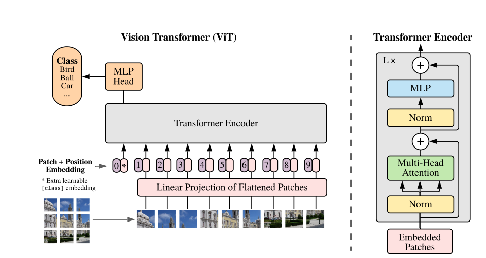

# Vision Transformer (ViT) Implementation

## Introduction

In this repository, we implement the Vision Transformer (ViT) model from scratch using PyTorch. While modern deep learning models are typically not built from scratch due to their complexity, understanding and implementing these models can provide valuable insights. Still, implementing a model from scratch provides a much deeper understanding of how they work. We will use the `torch.nn` module, specifically leveraging the Multi-Head Attention mechanism.


## Vision Transformer Model Architecture

The Vision Transformer model was introduced by Dosovitskiy et al in the paper An Image is Worth 16×16 Words: Transformers for Image Recognition at Scale., represents an image as a sequence of patches, processing it using a transformer model initially developed for NLP tasks.


Figure 1. Vision Transformer model architecture [Source](https://arxiv.org/pdf/2010.11929)


### Directory Structure

The following is the directory structure for this introduction:
```
|-- images
|   |-- car-image-patches-from-vision-transformer.png
|   |-- tranformer-encoder.png
|   |-- vision-transformer-image-to-patch.png
|   |-- vision-transformer-model-architecture.png
|-- main.py
|-- model_initialization
|   |-- attention_block.py
|   |-- patch_creation.py
|   |-- vit_model.py
|   |-- __init__.py
|-- README.md
|-- requirements.txt
|-- __init__.py
```

By running the `main.py` file we execute all the code for creating Vision Transformer from scratch.

## Libraries and Dependencies

PyTorch is the primary dependency for this implementation.

## Implementation Details

Let’s start coding the Vision Transformer model. As we discussed earlier, it is not entirely from scratch but using the `torch.nn` module. The major dependency is the `MultiheadAttention` class that we are not going to code from scratch.

We will go through each section of the model and code. Let’s start with the function that will create patches.

### 1. Creating Patches

#### 2D Convolution to Create Patches

The first and foremost preprocessing step is to convert the images (or more likely tensors) into patches. For instance, take a look at the following image from the paper.


Figure 2. Vision Transformer image to patch [Source](https://arxiv.org/pdf/2010.11929)

The above is a more simplified version of what happens internally. Suppose that we input **224×224 image** (let’s forget about tensors for now) to the patch creation layer. We want **each patch to be 16×16 pixels.** That would leave us with **224/16 = 14 patches across the height and width**.

**But do we need to write the patch creation code for Vision Transformer manually?** Not necessarily. We can easily employ the `nn.Conv2d` class for this. The following block creates a `CreatePatches` class that does the job for us.

`model_initialization\patch_creation.py`
```
import torch.nn as nn
import torch

class CreatePatches(nn.Module):
    def __init__(self, channels=3, embed_dim=768, patch_size=16):
        super().__init__()
        self.patch = nn.Conv2d(
            in_channels=channels,
            out_channels=embed_dim,
            kernel_size=patch_size,
            stride=patch_size
        )

    def forward(self, x):
        patches = self.patch(x).flatten(2).transpose(1, 2)
        return patches
```

        
2. Self-Attention Block
Next, we define the self-attention block using the nn.MultiheadAttention class.

python
Copy code
class AttentionBlock(nn.Module):
    def __init__(self, embed_dim, hidden_dim, num_heads, dropout=0.0):
        super().__init__()
        self.pre_norm = nn.LayerNorm(embed_dim, eps=1e-06)
        self.attention = nn.MultiheadAttention(
            embed_dim=embed_dim,
            num_heads=num_heads,
            dropout=dropout,
            batch_first=True
        )
        self.norm = nn.LayerNorm(embed_dim, eps=1e-06)
        self.MLP = nn.Sequential(
            nn.Linear(embed_dim, hidden_dim),
            nn.GELU(),
            nn.Dropout(dropout),
            nn.Linear(hidden_dim, embed_dim),
            nn.Dropout(dropout)
        )

    def forward(self, x):
        x_norm = self.pre_norm(x)
        x = x + self.attention(x_norm, x_norm, x_norm)[0]
        x = x + self.MLP(self.norm(x))
        return x
3. Final Vision Transformer Model
The final ViT model class combines the above components and adds additional layers required for the Vision Transformer.

python
Copy code
class ViT(nn.Module):
    def __init__(self, img_size=224, in_channels=3, patch_size=16, embed_dim=768, hidden_dim=3072, num_heads=12, num_layers=12, dropout=0.0, num_classes=1000):
        super().__init__()
        self.patch_size = patch_size
        num_patches = (img_size // patch_size) ** 2
        self.patches = CreatePatches(channels=in_channels, embed_dim=embed_dim, patch_size=patch_size)
        self.pos_embedding = nn.Parameter(torch.randn(1, num_patches + 1, embed_dim))
        self.cls_token = nn.Parameter(torch.randn(1, 1, embed_dim))
        self.attn_layers = nn.ModuleList([AttentionBlock(embed_dim, hidden_dim, num_heads, dropout) for _ in range(num_layers)])
        self.dropout = nn.Dropout(dropout)
        self.ln = nn.LayerNorm(embed_dim, eps=1e-06)
        self.head = nn.Linear(embed_dim, num_classes)
        self.apply(self._init_weights)

    def _init_weights(self, m):
        if isinstance(m, nn.Linear):
            nn.init.trunc_normal_(m.weight, std=.02)
            if m.bias is not None:
                nn.init.constant_(m.bias, 0)
        elif isinstance(m, nn.LayerNorm):
            nn.init.constant_(m.bias, 0)
            nn.init.constant_(m.weight, 1.0)

    def forward(self, x):
        x = self.patches(x)
        b, n, _ = x.shape
        cls_tokens = self.cls_token.expand(b, -1, -1)
        x = torch.cat((cls_tokens, x), dim=1)
        x += self.pos_embedding
        x = self.dropout(x)
        for layer in self.attn_layers:
            x = layer(x)
        x = self.ln(x)
        x = x[:, 0]
        return self.head(x)
4. Main Block
A simple main block to verify the implementation.

python
Copy code
if __name__ == '__main__':
    model = ViT(
        img_size=224,
        patch_size=16,
        embed_dim=768,
        hidden_dim=3072,
        num_heads=12,
        num_layers=12
    )
    print(model)
    total_params = sum(p.numel() for p in model.parameters())
    print(f"{total_params:,} total parameters.")
    total_trainable_params = sum(p.numel() for p in model.parameters() if p.requires_grad)
    print(f"{total_trainable_params:,} training parameters.")
    rnd_int = torch.randn(1, 3, 224, 224)
    output = model(rnd_int)
    print(f"Output shape from model: {output.shape}")
Results
The implementation matches the PyTorch VIT_B_16 parameters exactly. Changing hyperparameters for larger models (VIT_L_16 and VIT_H_14) also aligns with the PyTorch implementation.

Summary
In this article, we implemented the Vision Transformer model from scratch. In the next part, we will train the Vision Transformer model and optimize it for the best results. If you have any questions or suggestions, please leave them in the comment section.